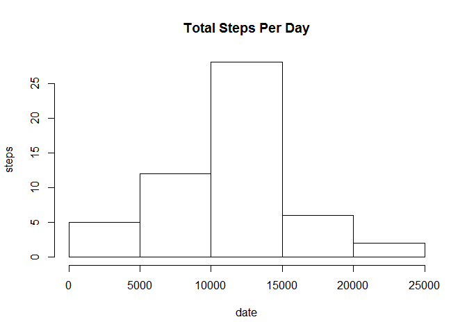
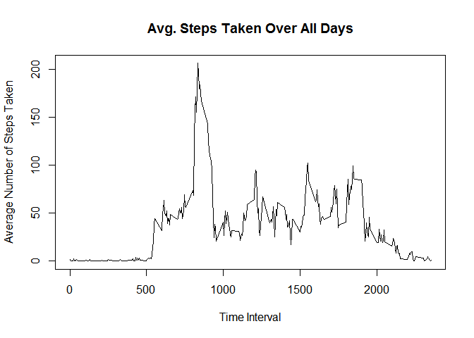
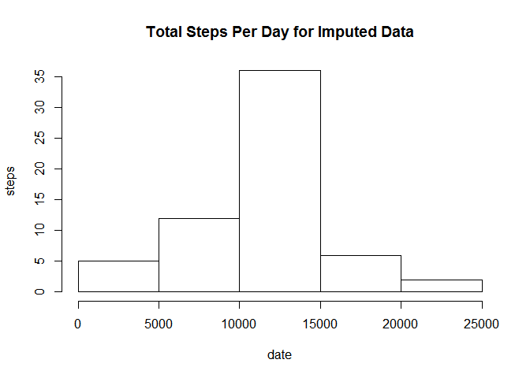
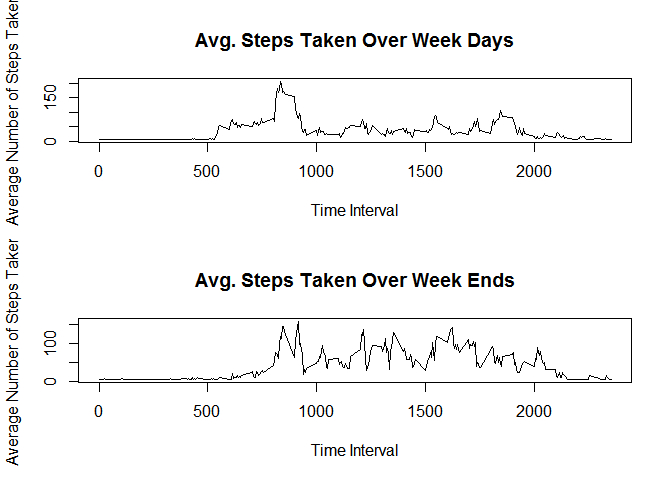

# Reproducible Research: Peer Assessment 1


## Loading and preprocessing the data

```r
library(dplyr)
```

```
## Warning: package 'dplyr' was built under R version 3.1.3
```

```
## 
## Attaching package: 'dplyr'
## 
## The following object is masked from 'package:stats':
## 
##     filter
## 
## The following objects are masked from 'package:base':
## 
##     intersect, setdiff, setequal, union
```

```r
data <- read.csv("activity.csv", header=TRUE)
data$date <- as.Date(data$date, "%Y-%m-%d")
```

## What is mean total number of steps taken per day?

```r
clean_data <- filter(data, is.na(steps)==FALSE)
relevant_data <- select(clean_data, date, steps)
data_by_day <- group_by(relevant_data, date)
steps_per_day <- summarize(data_by_day, total_steps=sum(steps))
steps_per_day
```

```
## Source: local data frame [53 x 2]
## 
##          date total_steps
## 1  2012-10-02         126
## 2  2012-10-03       11352
## 3  2012-10-04       12116
## 4  2012-10-05       13294
## 5  2012-10-06       15420
## 6  2012-10-07       11015
## 7  2012-10-09       12811
## 8  2012-10-10        9900
## 9  2012-10-11       10304
## 10 2012-10-12       17382
## ..        ...         ...
```

```r
hist(steps_per_day$total_steps, 
     main="Total Steps Per Day", xlab="date", ylab="steps")
```

 

```r
summary(steps_per_day)
```

```
##       date             total_steps   
##  Min.   :2012-10-02   Min.   :   41  
##  1st Qu.:2012-10-16   1st Qu.: 8841  
##  Median :2012-10-29   Median :10765  
##  Mean   :2012-10-30   Mean   :10766  
##  3rd Qu.:2012-11-16   3rd Qu.:13294  
##  Max.   :2012-11-29   Max.   :21194
```


## What is the average daily activity pattern?

```r
aggregate_steps_by_interval <- aggregate(steps ~ interval, data, mean)

plot(aggregate_steps_by_interval$interval, aggregate_steps_by_interval$steps, type='l', 
     main="Avg. Steps Taken Over All Days", xlab="Time Interval", 
     ylab="Average Number of Steps Taken")
```

 

```r
row_with_max_steps <- which.max(aggregate_steps_by_interval$steps)
aggregate_steps_by_interval[row_with_max_steps, ]
```

```
##     interval    steps
## 104      835 206.1698
```
As can be seen above, the interval with the maximumm average number of steps is the 104th interval corresponding to the 835 interval. The average number of steps taken in this interval are 206.1698

## Imputing missing values
For the purpose of this assignment, I have taken a very simple approach and replaced all NA values with the mean number of steps of the entire dataset. To my knowledge, the mean is the best estimation for an unknown value in a dataset hence I went with this strategy. The code is given in the chunk below:


```r
data2 <- data
n <- nrow(data2)
for (i in 1:n) {
  if(is.na(data2$steps[i])) {data2$steps[i] <- mean(clean_data$steps)}
}

data_by_day_imputed <- group_by(data2, date)
steps_per_day_imputed <- summarize(data_by_day_imputed, total_steps=sum(steps))
steps_per_day_imputed
```

```
## Source: local data frame [61 x 2]
## 
##          date total_steps
## 1  2012-10-01    10766.19
## 2  2012-10-02      126.00
## 3  2012-10-03    11352.00
## 4  2012-10-04    12116.00
## 5  2012-10-05    13294.00
## 6  2012-10-06    15420.00
## 7  2012-10-07    11015.00
## 8  2012-10-08    10766.19
## 9  2012-10-09    12811.00
## 10 2012-10-10     9900.00
## ..        ...         ...
```

```r
hist(steps_per_day_imputed$total_steps, 
     main="Total Steps Per Day for Imputed Data", xlab="date", ylab="steps")
```

 

```r
summary(steps_per_day_imputed)
```

```
##       date             total_steps   
##  Min.   :2012-10-01   Min.   :   41  
##  1st Qu.:2012-10-16   1st Qu.: 9819  
##  Median :2012-10-31   Median :10766  
##  Mean   :2012-10-31   Mean   :10766  
##  3rd Qu.:2012-11-15   3rd Qu.:12811  
##  Max.   :2012-11-30   Max.   :21194
```


## Are there differences in activity patterns between weekdays and weekends?

```r
data2['type_of_day'] <- weekdays(data2$date)
data2$type_of_day[data2$type_of_day  %in% c('Saturday','Sunday') ] <- "weekend"
data2$type_of_day[data2$type_of_day != "weekend"] <- "weekday"

weekday_data <- filter(data2, type_of_day=="weekday")
weekend_data <- filter(data2, type_of_day=="weekend")

aggregate_steps_by_interval_weekdays <- aggregate(steps ~ interval, weekday_data, mean)
aggregate_steps_by_interval_weekend <- aggregate(steps ~ interval, weekend_data, mean)

par(mfrow=c(2,1))
plot(aggregate_steps_by_interval_weekdays$interval, aggregate_steps_by_interval_weekdays$steps,
     type='l', main="Avg. Steps Taken Over Week Days", xlab="Time Interval", 
     ylab="Average Number of Steps Taken")

plot(aggregate_steps_by_interval_weekend$interval, aggregate_steps_by_interval_weekend$steps,
     type='l', main="Avg. Steps Taken Over Week Ends", xlab="Time Interval", 
     ylab="Average Number of Steps Taken")
```

 
